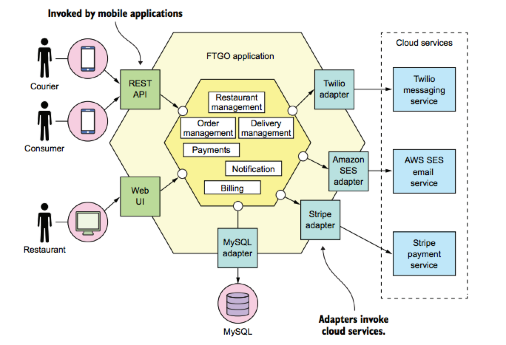
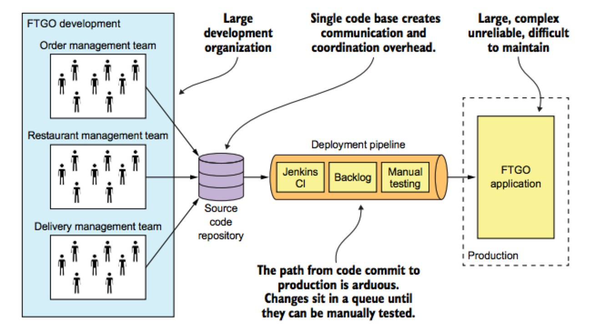

# 逃离单体地狱

> 单体地狱的特征，如何借助微服务架构逃离单体地狱

> 微服务架构的基本特征，好处与坏处

> 开发大型复杂应用时，如何借助微服务实现 DevOps 式开发模式

> 微服务架构的模式语言及为什么使用它

## 单体架构

单体架构

+ 入站 `(inbound)` 适配器: 通过调用业务逻辑来处理各类请求
  - `REST API`
  - `Web` 用户界面
  
+ 出站 `(outbound)` 适配器: 使业务逻辑能够访问 `MySQL` 数据库并调用 `Twilio` 和 `Stripe` 等云服务
 

优点

1. 应用的开发很简单
2. 易于对应用程序进行大规模的更改
3. 测试相对简单直观
4. 部署简单明了
5. 横向扩展不费吹灰之力

### 单体地狱

单体地狱

缺点

1. 过度的复杂性会吓退开发者
2. 开发速度缓慢
3. 从代码提交到实际部署的周期很长，而且容易出错
4. 难以扩展
5. 交付可靠的单体应用是一项挑战
6. 需要长期依赖某个可能已经过时的技术栈

## 什么是微服务

面向服务的架构。可以从三个维度扩展。

1. X 轴扩展: 在多个实例之间实现请求的负载均衡
2. Y 轴扩展: 根据功能把应用拆分为服务
3. Z 轴扩展: 根据请求的属性路由请求

## 微服务的优点

1. 使大型的负责应用程序可以持续交付和持续部署
2. 每个服务都相对较小并容易为辅
3. 服务可以独立部署
4. 服务可以独立扩展
5. 微服务架构可以实现团队的自洽
6. 更容易实验和采纳新的技术

## 微服务的缺点

  
1. 服务的拆分和定义是一项挑战
2. 分布式系统带来的各种负责性，使开发、测试和部署变得更困难
3. 当部署跨越多个服务的功能是需要谨慎地协调更多的开发团队
4. 开发者需要思考到底应该在应用的什么阶段使用微服务架构

